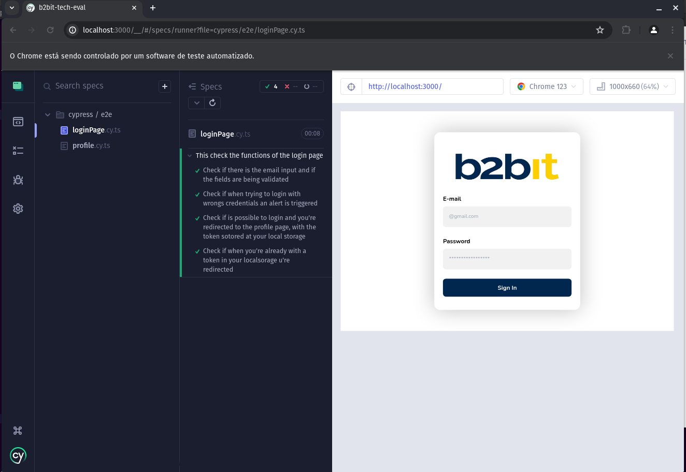

# B2bit - Teste Frontend

## Tecnologias utilizadas

- Next.js
- Typescript
- Cypress
- TailwindCSS
- axios

## Deploy

- Deploy feito na Vercel, já que fiz o projeto com Next.js, e a vercel proporciona um deploy fácil e rápido.
- [Deploy](https://b2bit-tech-eval.vercel.app/)

## Como rodar o projeto

- Clone o repositório

```bash
git clone git@github.com:GabrielFeBe/b2bit-tech-eval.git

```

- Entre na pasta do projeto

```bash
cd b2bit-tech-eval
```

- Instale as dependências

```bash
npm install
```

- Rode o projeto

```bash

npm run dev

```

## Configurações do projeto

- O next é configurado para rodar na porta 3000.
- Estou usando o next/image para otimizar as imagens, você precisa colocar o host da imagem no arquivo next.config.js, caso contrário, o next/image não irá funcionar e a aplicação irá quebrar.
- Todas as interceptions estão no arquivo `src/lib/api.ts`, caso você queira mudar a url base da api, você pode fazer isso nesse arquivo.

## Testes

- Para rodar os teste E2E, é necessario que a aplicação esteja rodando na porta 3000.

- Todos os endpoints da api estão nos teste sendo mockados, então não é necessário que a api esteja rodando.

- Testes de componentes não precisam que a aplicação esteja rodando.

- Para rodar os testes E2E sem interface gráfica, com o projeto rodando na sua maquina, você precisa rodar o comando:

```bash
npm test
```

- Para rodar os testes, com interface gráfica, você precisa rodar o comando:

```bash
npm run cypress:open
```

- O cypress irá abrir uma janela :

<details>
<summary>Imagem ilustrativa</summary>

</details>

- Ao clicar no E2E Testing ou no Component Testing, você precisa escolher o navegador que você deseja rodar os testes e clicar no botão verde:

<details>
<summary>Imagem ilustrativa</summary>

</details>

- Apos clicar no botão ele vai abrir uma nova janela com o navegador escolhido na qual você pode selecionar o teste que deseja rodar.
<details>
<summary>Imagem ilustrativa</summary>

</details>

- Imagem do teste rodando:
<details>
<summary>Imagem ilustrativa</summary>

</details>
